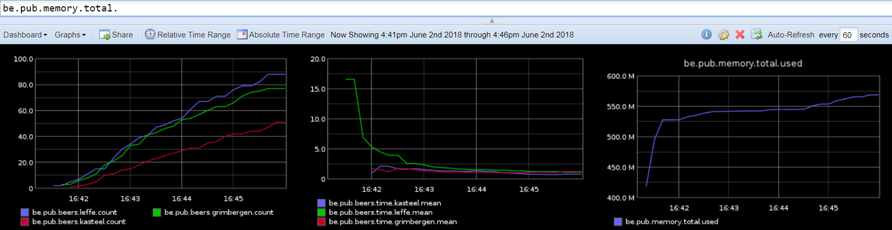

# pub-metrics

Example project to count requests in a JAX RS application 
with [dropwizard-metrics](https://metrics.dropwizard.io/4.0.0/) 
and report them to [Graphite](https://graphiteapp.org/) for visualization.

## Graphite setup 
Start Graphite via the [recommended](http://graphite.readthedocs.io/en/latest/install.html) docker image. I had to add the portmapping 8081:8080 to access the dashboard:
```
docker run -d\  
 --name graphite\  
 --restart=always\      
 -p 80:80\
 -p 8081:8080\  
 -p 2003-2004:2003-2004\
 -p 2023-2024:2023-2024\
 -p 8125:8125/udp\
 -p 8126:8126\
 graphiteapp/graphite-statsd
```

## Run pub application
Build the application with [Maven](https://maven.apache.org/):
```
mvn package
```
Run the war file with the lates version of Payara Micro (https://www.payara.fish/downloads). Specify the Graphite server with environment args:
```
java -Dgraphite.url=192.168.99.100\
     -Dgraphite.port=2003\
     -jar payara-micro-5.181.jar\
     --deploy pub-metrics-1.0-SNAPSHOT.war
```
List all available beers  
http://localhost:8080/pub/beers

The application registers the metrics admin Servlet as described in the [documentation](https://metrics.dropwizard.io/3.1.0/manual/servlets/). It can be accessed via  
http://localhost:8080/metrics

## Collecting metrics and view on dashboard

Order some beers. Available are Leffe, Grimbergen, Kastell  
http://localhost:8080/pub/beers/{name} 

View metrics on Dashboard  
http://192.168.99.100:8081/dashboard




